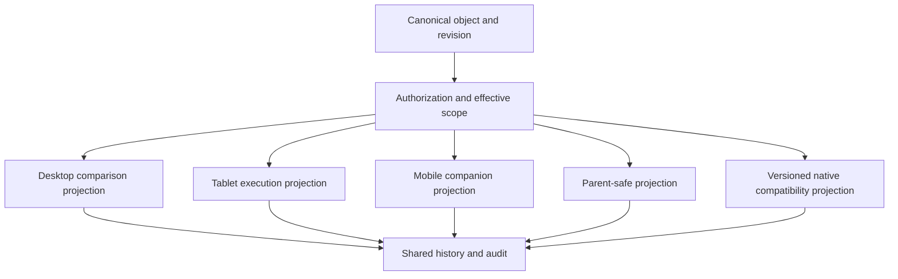

# Kiddz Online Cross-Device Synthesis

**Status:** Research synthesis v1
**Last updated:** 2026-07-10
**Product posture:** Desktop first; task-specific tablet, mobile web, parent, and native companion experiences

## Purpose

This document defines how Kiddz Online should behave across desktop, compact desktop, tablet, mobile web, parent web, and preserved native contracts. It turns responsive measurements, role runtime, critical journey contracts, and benchmark flow patterns into a cross-device operating model.

Cross-device continuity does not mean one universal layout. The same operational objects, authorization decisions, drafts, and history travel between surfaces; each surface composes them around the job that can be completed well there.

## Evidence Inputs

- `responsive-runtime-audit.md` and `responsive-baseline-metrics.json`.
- `role-runtime-audit.md` for manager, teacher, nurse, doctor, and parent homes.
- `journey-state-audit.md` for state, mutation, interruption, and recovery contracts.
- `authorization-scope-audit.md` for role, assignment, and effective-scope boundaries.
- `localization-runtime-audit.md` for machine/display separation, operational time, bidi behavior, and native payload evolution.
- `reliability-offline-audit.md` for platform-specific storage, service-worker boundaries, operation receipts, drafts, replay, and conflict behavior.
- `accessibility-runtime-audit.md` for semantic parity, targets, reflow, focus, status, forms, tables, charts, and assistive-technology fixtures across projections.
- `performance-runtime-audit.md` for authenticated route density, eager-list risks, bounded data contracts, route-local delivery, field instrumentation, and scale fixtures.
- `data-delivery-contract.md` for server-owned collection windows, complete working sets, async option sources, cross-page selection, comparison grids, and durable outputs.
- `operational-architecture-synthesis.md` for canonical objects and Today hierarchy.
- `mobbin-flow-study.md` for contextual sheets, durable status, progress, and return-to-work.
- `flow-inventory.md` and parity ledger for legacy web aliases and native parent APIs.

## Current Failure Pattern

The product has responsive breakpoints but no responsive operating model.

- Mobile Dashboard is 3,602 CSS pixels tall and still leads with organization totals.
- Mobile Today is 9,085 pixels tall and retains 192 interactive elements.
- Children exposes 77 partially out-of-bounds interactions at 390 pixels.
- Accounting removes much horizontal overflow by stacking nearly the full desktop information burden into 3,886 pixels.
- At 1024, chart labels clip even when the page technically fits.
- Fixed mobile navigation can cover lower content.
- Most visible controls remain below the 44-pixel floor-work target.

The redesign must change job hierarchy, representation, action density, and navigation by surface, not only width and stacking order.

## Device Responsibilities

| Surface | Primary role | Best at | Must not become |
| --- | --- | --- | --- |
| Wide desktop | Manager, administrator, finance, operations | Compare, plan, reconcile, review evidence, resolve multiple work items | Oversized card gallery or mobile layout with empty margins |
| Compact desktop | Manager and office staff | Same operational hierarchy with focused secondary context | Clipped wide-desktop composition |
| Tablet landscape | Room leader, practitioner, mobile manager | Operate one room, batch record, hand over, respond to assigned work | Shrunk admin dashboard |
| Tablet portrait | Practitioner and review-on-the-move | Focused roster, care form, incident capture, child context | Two narrow panes with unusable controls |
| Mobile web | Practitioner, manager companion | Capture, confirm, scan, message, receive urgent assigned work, resume | Full desktop page stacked vertically |
| Parent web/native | Parent or guardian | Understand child changes, respond, acknowledge, report absence, pay | Multi-year archive rendered as one feed |
| Legacy native contracts | Existing iOS/Android clients | Preserve parent-safe data and established actions | Unversioned API redesign that breaks installed clients |

## One Object, Multiple Projections

Every operational object defines a shared core and surface-specific projection.

The projection can change fields, density, and actions. It cannot invent a different attendance status, balance, incident state, or completion truth.

## Shared Continuity Contract

The following context travels with every cross-device handoff:

- organization and branch;
- room or record scope where applicable;
- local operational date and time mode;
- user role and effective assignment scope;
- source object ID and revision;
- draft ID, author, and sync state;
- current workflow step;
- selected records and explicit batch values where safe;
- return destination;
- pending conflict, permission, or acknowledgment state.

Deep links must reopen the same object and safe context after authentication. If scope changed, the user receives a purposeful denial or safe fallback rather than a silent redirect.

## Handoff States

Cross-device work uses explicit status:

| State | Meaning | Required UI |
| --- | --- | --- |
| Local draft | Not yet accepted by server | Device label, unsynced indicator, safe exit warning |
| Synced draft | Server has the revision | Last saved time and resume on another device |
| Syncing | Transfer active | Non-blocking progress and ability to keep reading |
| Conflict | Server changed since the draft base | Compare, preserve both inputs, authorized resolution |
| Submitted | Server accepted a transition | Confirmed summary and downstream state |
| Pending external | Waiting for parent, manager, or system | Owner, due state, and notification history |
| Failed | Server rejected or transfer failed | Preserved input, exact reason category, retry/correct path |

Browser local storage alone cannot represent completion. High-risk transitions require a server-confirmed result.

## Responsive Layout Bands

Breakpoints are starting constraints, not device detection.

### Wide desktop: 1440 pixels and above

- Persistent labeled navigation and operational context.
- Today can show readiness, room comparison, and work queue simultaneously when each remains legible.
- Tables preserve comparison, bulk action, frozen identity, and column controls.
- Inspect panels can open beside a list without losing the source selection.
- Multi-column forms are allowed when reading and keyboard order remain coherent.

### Compact desktop: approximately 1280

- Preserve the same manager hierarchy.
- Reduce simultaneous secondary modules before compressing primary meaning.
- Secondary metadata moves to inspect panels, drawers, or disclosure regions.
- Charts keep a minimum plot/label size or become ranked text/timeline representations.
- No page-level horizontal scrolling.

### Tablet landscape: approximately 1024

- Default to a room or task workspace rather than organization overview.
- Navigation becomes a labeled compact rail, contextual menu, or task switcher, not unexplained icons alone.
- One primary pane plus an optional useful inspect pane.
- Primary floor actions use at least 44 x 44 CSS pixel targets.
- Tables use task-specific column sets and bounded horizontal overflow only where comparison still matters.

### Tablet portrait: approximately 768

- One focused workspace at a time.
- Detail opens as a full-height sheet or destination, preserving return state.
- Forms use logical sections and a stable action area.
- Room roster rows remain large enough for touch, state, and exception context.

### Mobile: approximately 390

- Role-specific companion with current state and one primary action in the first viewport.
- Search, scan, arrival/departure, quick care, incident capture, message, acknowledgment, and payment confirmation are first-class.
- Broad planning, dense configuration, and multi-record reconciliation open in simplified read/review forms or are deferred to desktop with an explicit reason.
- Bottom navigation and sticky actions reserve safe-area and keyboard insets.
- Mobile pages do not reproduce full tables or hundreds of equal controls.

## Navigation By Surface

### Desktop

- Stable domains: Today, Children, People, Places, Communication, Finance, Reports, and Settings.
- Search/command, recents, saved views, and work queue complement navigation.
- Branch, time mode, date, and user scope remain visible.
- Contextual record navigation stays inside the object workspace.

### Tablet

- Role home, current room, assigned work, children, communication, and a concise domain menu.
- Context switcher privileges room/branch assignment and current shift.
- Recent objects and drafts are easy to resume.
- Manager-only broad navigation remains reachable without dominating floor work.

### Mobile staff

- Suggested primary set: Home, Room/Today, Capture, Messages, More.
- The exact labels vary by role and require prototype testing.
- A central capture action is justified only if it exposes real permitted actions, not a decorative floating button.
- Urgent assigned work may surface above navigation but cannot cover active input.

### Parent

- Today, Messages, Calendar/Requests, Finance, and Child/More are candidate domains.
- Unread and obligation state leads; archive depth is progressively disclosed.
- Multiple children remain a persistent, safe context switch.

## Today Across Devices

### Manager desktop

- Branch readiness statement.
- Room operating plane with live and forecast ratio state.
- Owned work queue.
- Secondary occupancy, finance, communication, and completion outlook.

### Manager tablet/mobile

- Highest-consequence current state.
- Assigned or unowned urgent work.
- Compact room list ordered by risk/change.
- One-tap route to inspect cause and resolve.
- Cross-branch planning and historical analytics recede.

### Practitioner tablet

- Current room identity, roster freshness, and ratio context.
- Arrivals/departures and incomplete care work.
- Batch action first, child exception second.
- Visible handover and unsynced drafts.

### Practitioner mobile

- Current room and next required action.
- Fast scan/search and explicit child state.
- Focused capture with minimum fields, progressive exception evidence, and immediate resume.

## Attendance Across Devices

### Desktop

- Compare expected and observed state by room.
- Batch mark observed states with a review summary.
- Inspect unknowns, corrections, source, and ratio consequence.
- Manager can reassign, approve correction, or investigate anomalies within capability.

### Tablet

- Stable roster with large explicit state controls.
- Unknown is visually first-class; present is never preselected.
- Scanner or quick search can focus one child without losing batch progress.
- Review shows exceptions, warnings, count, room consequence, and sync state.

### Mobile

- One child or a short room slice at a time.
- Arrival/departure action stays in a thumb-reachable region.
- Medical/collection warnings appear before the transition, scoped to the role.
- Repeated work supports rapid return to scan/search.

All surfaces write the same attendance session and events. Correction history is visible wherever correction is permitted.

## Room Care Across Devices

- Desktop manages completeness, review, approval, parent delivery, and multiple rooms.
- Tablet is the primary batch-entry surface: choose an observed shared value, apply to selected children, then edit exceptions.
- Mobile captures one observation, attachment, or exception quickly and can add it to an existing synced room session.
- Unobserved factual fields remain unset on every device.
- Draft, submitted, approved, communicated, and conflict states never share the same visual completion treatment.

## Records And Tables Across Devices

### Desktop data workspace

- Bounded internal scrolling.
- Frozen identity or key column.
- Column presets tied to user intent.
- Saved views and readable active-filter summary.
- Bulk action is an explicit mode.
- Detail inspect panel preserves selection and list context.

### Tablet

- Purpose-specific columns, not a squeezed desktop set.
- Row actions become labeled menus or sheets with sufficient targets.
- Detail replaces or meaningfully splits the list based on available width.

### Mobile

- Search and saved views first.
- Summary row shows identity, critical state, one secondary fact, and disclosure.
- Record detail is a destination with anchored current state and actions.
- Full export/configuration options can remain reachable under More but do not crowd routine work.

## Forms Across Devices

Every form defines:

- entry context and source object;
- field grouping and progressive exception rules;
- draft/save behavior;
- server validation and error return;
- keyboard order and focus recovery;
- sticky action behavior without covering fields;
- attachment capture and progress;
- review/consequence step where needed;
- conflict and stale-revision handling;
- completion return destination.

Desktop can use a two-column grid when fields are genuinely related. Mobile uses one readable sequence, not an arbitrary serialization of the desktop grid.

## Health, Safety, And Incident Capture

- Mobile/tablet support rapid draft initiation, photo/file capture, and immediate escalation.
- Required evidence changes with form type and state; the server remains authoritative.
- Sensitive detail uses role-safe projections and protected device/session behavior.
- Submission creates owned follow-up and shows delivery/acknowledgment state.
- Clinical review and full evidence comparison are optimized for desktop or useful tablet width.
- No device presents a cute success celebration for an incident; feedback is factual and reassuring.

## Finance Across Devices

- Desktop owns ledger reconciliation, allocation, reversals, funding context, and reporting.
- Tablet supports family lookup and payment/receipt review where operationally needed.
- Mobile prioritizes amount confirmation, payment evidence, allocation summary, remaining balance, and receipt delivery.
- Parent surfaces show one family-safe balance truth, clear due state, payment history, and accessible receipt.
- Currency, date, and amount remain stable and locale-aware across handoff.

## Messaging And Notifications

- A conversation, broadcast, call, incident follow-up, and work item remain distinct objects.
- Mobile and tablet optimize reading, replying, capture, and acknowledgment.
- Desktop supports audience selection, broadcast review, delivery audit, and action tracking.
- Push/email/native notifications deep-link to the exact permitted object and revision.
- Notification dismissal does not close operational work.
- Offline composition preserves the draft and makes send state explicit.

## Parent Experience

The current parent portal proves broad data access but eagerly renders 213 historical reports into a 17,400-pixel document. The target parent experience prioritizes:

1. what changed today;
2. what is unread;
3. what requires response, acknowledgment, absence input, or payment;
4. upcoming calendar state;
5. recent records;
6. searchable/paginated archive.

Parent-safe projections never expose staff-only notes, other children, internal severity, or operational details outside policy. Web and native may use different layouts but must agree on state and permissions.

## Native And Legacy Compatibility

The repository retains legacy iOS and Android parser contracts through `/ws/**`, `/api/parent/**`, PHP-compatible aliases, encrypted-ID bridges, and parent web routes.

Rules:

- Existing response shapes remain versioned and tested until all supported clients migrate.
- New canonical objects receive compatibility adapters rather than ad hoc duplicate state.
- Breaking native changes require a new version, migration window, telemetry, and rollback path.
- Parent-safe fields and permissions are evaluated before projection, not removed only in the client.
- File URLs, dates, encodings, and empty/error semantics remain contract-tested.
- Native clients need their own interaction audit before visual redesign; web screenshots are not a native specification.
- Legacy routes remain valid deep links into canonical web workflows or compatibility rendering.

## Offline Capability Levels

Offline support is defined per action after risk review.

| Level | Capability | Suitable examples | Constraint |
| --- | --- | --- | --- |
| 0 | Read requires network | Sensitive current state that cannot be safely cached | Clear unavailable state |
| 1 | Read cached snapshot | Roster or recent child-safe summary | Visible as-of time and stale label |
| 2 | Local draft | Care note, message, incident draft | Not represented as submitted |
| 3 | Queued idempotent action | Approved low-risk capture after policy review | Visible pending state and duplicate key |
| 4 | Conflict-aware collaborative edit | Selected workflows with revisions | Explicit merge/owner policy |

Attendance, health transitions, ratio overrides, financial allocation, and access changes do not receive optimistic offline completion without a validated legal and conflict model.

## Sync And Connectivity UX

- Connectivity is not shown as a global alarm unless it affects current work.
- Each affected object displays `saved locally`, `syncing`, `synced`, `conflict`, or `failed`.
- A queue view shows pending work, age, target, retry, and cancellation where safe.
- Reconnection does not silently overwrite a newer server revision.
- Upload progress names the file or record and survives navigation where feasible.
- Success appears only after server acceptance for server-owned transitions.

## Input And Ergonomic Rules

- Floor actions target at least 44 x 44 CSS pixels; destructive and adjacent targets receive extra separation.
- Keyboard-first desktop flows retain visible focus, shortcuts where useful, and predictable tab order.
- Touch interfaces do not depend on hover or tiny icon clusters.
- Camera, scanner, file, date/time, and phone capabilities use platform-appropriate controls.
- Sticky actions reserve keyboard and safe-area space.
- Long names, translated labels, large text, and 200% zoom cannot hide state or action.
- Rotation and resize preserve unsaved input and selected context.

## Performance Budgets By Experience

- Shell and page identity render before slower modules.
- Core input acknowledges immediately.
- Live state updates do not cause layout shift.
- Large lists paginate or virtualize according to real data and accessibility behavior.
- Mobile history does not render the full archive eagerly.
- Images and attachments use previews, compression, progress, and lazy loading.
- Motion targets 60 fps on representative devices and favors transform/opacity.
- Slow or long-running work exposes named stages, retry, and durable output.
- Unreliable Wi-Fi is tested deliberately, not inferred from a loading spinner.

The initial route, DOM, collection, media, motion, and measurement gates are defined in `performance-runtime-audit.md`. Exact per-route byte budgets are calibrated only after route-aware JavaScript, RSC, CSS, font, image, and third-party attribution exists on representative hardware; total files on build disk are not a transfer budget.

## Accessibility Across Devices

- WCAG 2.2 AA is the minimum web target.
- State uses label, icon, position, and wording in addition to color.
- Screen-reader order matches the visual task hierarchy.
- Dynamic updates announce consequence without flooding live regions.
- Focus moves purposefully into and out of sheets, dialogs, and errors.
- Reduced motion preserves state continuity without spatial animation.
- Large text and zoom reflow into usable task-specific layouts.
- Charts have equivalent text/table access and are never required to understand critical state.
- Native surfaces follow platform accessibility APIs and text-size settings.

## Verification Matrix

Every implemented core flow is tested at minimum at:

- 1440 x 900 wide desktop;
- 1280 x 800 compact desktop;
- 1024 x 768 tablet landscape;
- 768 x 1024 tablet portrait;
- 390 x 844 mobile.

For each viewport verify:

1. primary state and action visibility;
2. navigation, back, escape, and return context;
3. loading, empty, partial, error, offline, conflict, denied, and success states;
4. keyboard, touch, screen-reader order, zoom, and reduced motion;
5. fixed-region insets and virtual keyboard behavior;
6. long names, localization, RTL, and large numbers;
7. console/runtime errors and network recovery;
8. parity destination, legacy alias, and native contract where applicable.

Committed visual evidence uses synthetic or redacted data unless personal-record capture is explicitly approved.

## Prototype Scenarios

The cross-device prototype must demonstrate complete handoff, not isolated screens:

1. Manager sees a forecast ratio risk on desktop, assigns cover, and practitioner receives the scoped task on tablet.
2. Practitioner begins room attendance on tablet, loses connection, resumes safely, and manager sees confirmed server state on desktop.
3. Practitioner starts an incident draft on mobile, adds evidence on tablet, and nurse triages it on desktop without duplicated records.
4. Manager records and allocates a payment on desktop; parent receives the same balance and receipt on mobile/native.
5. Parent reports an absence on mobile; room attendance and manager readiness update from the same event.
6. Administrator generates inspection evidence on desktop while named progress and completion remain visible after navigation.
7. A user follows a deep link after their branch assignment changed and receives a safe, understandable denial.

## Acceptance Gate

- Device responsibility is explicit for every critical workflow.
- Desktop preserves comparison and planning power without page-level overflow.
- Tablet and mobile reduce decision load rather than stacking the desktop page.
- Draft, revision, sync, conflict, and completion states travel across devices.
- Same object state and permissions appear in web, parent, legacy, and native projections.
- Touch targets, safe areas, keyboard behavior, zoom, and reduced motion pass verification.
- Offline behavior is named per action and never implies false completion.
- Parent history is progressive, not eagerly rendered in full.
- Existing native and PHP-compatible contracts remain tested through migration.
- All five required viewports pass Agent Browser verification with realistic state.

## Open Validation Debt

1. Which staff workflows are performed on shared tablets versus personal phones?
2. Which browsers, iOS versions, Android versions, scanners, and tablets remain supported?
3. Which actions are legally and operationally acceptable offline?
4. How long may sensitive data remain cached on shared devices?
5. What is the current native app release and API migration strategy?
6. Which parent obligations require push, email, SMS, in-app acknowledgment, or signatures?
7. Which tasks move between devices most often, and what context is currently lost?
8. What representative low-end hardware and nursery Wi-Fi conditions define the performance floor?

These questions must be resolved before production rollout. They do not justify using the same layout everywhere in the meantime.
