# Daily Care Contract

**Status:** Territory-neutral, executable, synthetic foundation
**Date:** 2026-07-11
**Prototype:** `/design-lab/daily-care`
**Contract:** `src/lib/redesign-daily-care-contracts.ts`
**Verifier:** `src/scripts/verify-redesign-daily-care-contracts.ts`

## Question

How can Kiddz keep high-volume room reporting fast without turning defaults into observations, counting drafts as done, creating a second absence truth, losing nested evidence during updates, or telling staff that a parent received something before delivery is proven?

## Current Product Evidence

| Current source | What it proves | What it does not prove |
| --- | --- | --- |
| `DailyReport` and child/date uniqueness | One current report row per child/date with `DRAFT` or `SUBMITTED` | Immutable revision history, optimistic concurrency, delivery, correction, or room-batch provenance |
| Daily report nested fever, milk, and attachment rows | Preserved care breadth and imported evidence | Atomic replacement during update; current update deletes nested rows before the parent update succeeds |
| Batch report page | Room/class roster intent and quick per-child entry | True shared values, explicit inheritance preview, exceptions, autosave, or safe interruption recovery |
| Batch defaults | Current code preselects `ALL` meal portions, sleep, sleep times, `HAPPY`, and false health flags | Observed facts; these values can be submitted without practitioner interaction |
| `hasReport` completion set | A report row exists | Whether it is a draft, complete, submitted, delivered, or corrected |
| `attendanceMode=ABSENT` in report metadata | Legacy report status compatibility | The canonical `AbsenceReport`/attendance transition used by adjacent modules |
| Direct approval setting and bulk draft approval | Imported `t_settings.direct_approval` behavior | A new universal legal approval rule |
| Parent/native daily endpoints | Relation-scoped access to `SUBMITTED` reports and complete legacy payload shapes | Delivery receipt, retry state, or corrected-revision publication |
| Print, export, listings, edit/create bridge, drafts, legacy PHP and native routes | Restored functional breadth | A canonical future workflow may not remove or silently reinterpret any of them |

The target therefore wraps preserved field and output breadth in a safer lifecycle. It does not replace imported records blindly or claim that current rows already contain missing revision/delivery evidence.

## Canonical Separation

The target keeps these objects distinct:

1. **Room care session:** room, date, roster, attendance source, policy source, selected children, and session revision.
2. **Field definition:** requiredness, allowed values, offline eligibility, parent visibility, and sensitivity.
3. **Pending shared observation:** explicit values and exact children before inheritance.
4. **Care observation:** child, field, value, observer, time, source revision, and provenance.
5. **Child exception:** a later observation for one field that preserves the inherited shared source and unrelated facts.
6. **Report revision:** immutable draft, submission, or correction snapshot.
7. **Sync conflict:** server and local fact, base revisions, source change, and chosen resolution.
8. **Parent delivery attempt:** report revision, recipient relation, pending/failed/delivered state, idempotency key, error, and receipt time.
9. **Correction draft:** reason, exact field/value, base revision, and publication state.
10. **Accepted session event:** actor, capability, expected revision, idempotency fingerprint, result, and history.

Consequences:

- unset is not `NONE`, `false`, zero, `HAPPY`, or `ALL`;
- scheduled menu is not consumed portion;
- attendance is referenced, not recreated inside care;
- draft is not submitted;
- submitted is not delivered;
- delivered is not acknowledged;
- correction appends and never overwrites the delivered revision;
- a retry changes delivery state, not report content;
- an offline queue is not server completion.

## Required Lifecycle

```mermaid
stateDiagram-v2
  [*] --> SourceGap
  SourceGap --> EmptyCapture: confirm roster, attendance, care, approval sources
  EmptyCapture --> SharedReview: choose present children and observed values
  SharedReview --> ExceptionReview: apply explicit inheritance
  ExceptionReview --> DraftSaved: record exception and save atomically
  DraftSaved --> SyncConflict: competing device revision arrives
  SyncConflict --> SubmissionBlocked: merge fact; source revision changed
  SubmissionBlocked --> DraftSaved: refresh complete source set
  DraftSaved --> Submitted: validate and submit selected reports atomically
  Submitted --> DeliveryFailed: provider attempt fails
  DeliveryFailed --> Delivered: retry returns receipts
  Delivered --> CorrectionReview: open reasoned correction
  CorrectionReview --> Corrected: append revision and new delivery obligation
```

Every accepted mutation checks capability, expected session revision, source freshness, and idempotency fingerprint. Exact replay returns the accepted state; changed input under the same key fails.

## Shared Entry and Exceptions

Shared entry is explicit batch work, not hidden cloning:

1. Select only children with a canonical `PRESENT` event and current attendance source.
2. Enter observed values; all factual fields begin unset.
3. Review exact selected children and values before application.
4. Apply observations with `SHARED` provenance and one shared-observation identity.
5. Add child differences as later `EXCEPTION` observations for the affected field only.
6. Preserve the inherited fact, exception, observer, time, and source revision.

Absent and unknown children cannot inherit care. An absent child remains linked to the attendance event and receives no invented care report. Unknown is never treated as present.

## Completeness and Atomic Submission

Required fields come from a versioned care-policy source. The synthetic fixture requires breakfast portion, lunch portion, observed mood, and explicit symptom observation only to test behavior; it does not define production policy.

Drafts may be incomplete. Submission may not. Before accepting a selected set, the server rechecks:

- every report is a current draft;
- every child remains present through the referenced attendance event;
- every required field has an observation;
- the complete source set is current;
- actor scope and submit capability;
- expected session and report revisions.

The set submits atomically. One missing field or stale attendance source rejects the complete set with no partial status change. The result returns exact accepted and pending-delivery counts.

## Draft, Offline, and Conflict

- Autosave targets versioned server drafts and exposes last accepted revision.
- Offline queueing is field-policy specific. Routine mood may queue; health observations and internal handover fields in the fixture do not.
- Queued work remains visibly unsynced and never decrements completion.
- A conflict preserves server fact, local fact, authors, times, and base revisions.
- Resolution changes one field and carries unrelated meal, health, attachment, and provenance facts forward.
- If attendance or another source advanced during conflict, submission pauses until a complete non-regressing refresh.

## Parent Publication

The parent projection is relation-scoped and deliberately smaller than staff state.

It exposes only:

- the linked child;
- successfully delivered report revisions;
- fields whose policy marks them parent-visible;
- corrected status only after that corrected revision is delivered.

It does not expose:

- room peers;
- staff drafts, counts, source revisions, or conflicts;
- delivery provider errors or recipient identifiers;
- audit actors;
- internal handover fields;
- submitted-but-undelivered or failed-delivery reports.

Current parent/native payload shapes remain compatibility outputs. Production migration must derive them from delivered canonical revisions without breaking installed clients.

## Correction

A submitted/delivered report is never edited in place. Correction requires:

- correction capability;
- a reason;
- exact base report revision;
- exact changed field/value;
- fresh session source revision.

Publication appends a `CORRECTION` revision with `correctsRevision` and reason, retains every prior revision, and creates a new independent parent-delivery job. The parent continues seeing the previously delivered revision until the correction has its own receipt.

## Role Projection

| Role | Visible and actionable | Withheld |
| --- | --- | --- |
| Nursery manager | Full room roster, sources, drafts, conflicts, recipient delivery state, audit, correction | Out-of-scope children and families |
| Room practitioner | Assigned room/children, observation provenance, drafts, conflicts, submit result, delivery status category | Parent account identity, audit actors, manager-only correction/delivery actions |
| Linked parent | Own child and delivered parent-visible revision only | Peers, drafts, sources, conflicts, failed delivery, recipient identities, internal fields, audit |

Production authorization must intersect organization, branch, room assignment, child relation, capability, and transition. Hiding a panel is not authorization.

## Production Migration Boundary

This slice is additive. Production migration requires:

1. Approved care field, completeness, parent visibility, attachment, retention, and offline policy.
2. Canonical room-care session, observation, report-revision, conflict, delivery, correction, and audit models.
3. One transaction for observations, nested fever/milk/attachment changes, report revision, submission state, and outbox entries.
4. Optimistic concurrency and exact idempotency on individual and batch writes.
5. Canonical attendance references; remove report-owned absence creation only after compatibility tests prove every old output.
6. Adapters for all current modern fields, `legacyData`, imported nested provenance, direct approval, print/export, list/draft behavior, and hard legacy identities.
7. Parent/native adapters for `/api/parent/daily/**`, `/ws/daily.php`, and `/ws/newdaily.php` with installed-client acceptance.
8. Reasoned archival/correction replacing hard delete only after policy and parity approval.
9. Representative room scale, shared-device interruption, offline/retry, concurrent edit, operator, assistive-technology, and real-device testing.

No current route, schema, row, action, print/export, parent/native response, or legacy alias changes in this foundation.

## Browser Evidence

Agent Browser exercised all 12 lifecycle states across:

- manager at `1440 x 900`;
- practitioner at `768 x 1024`;
- linked parent at `390 x 844`.

All 36 runs produced one H1, the expected projection heading, zero horizontal overflow, zero unnamed or undersized controls, zero axe violations, and zero axe incomplete findings. Empty capture exposed no synthetic half/most/calm/symptom values.

Parent runs exposed no Noah/Lina/Sami/Zoe identity, internal source/revision/draft/conflict/history/provider text, or recipient ID. Practitioner runs exposed no parent account identifier. The complete 12-action manager flow returned focus to the changed heading, updated the polite live region, and produced no action error. Desktop and mobile visual inspection found coherent hierarchy and scrolling; browser warning/error logs were empty.

## Deterministic Evidence

The verifier proves:

- all 12 lifecycle states;
- no initial observations or reports;
- complete/non-regressing source confirmation;
- absent/unknown selection rejection;
- explicit shared preview and exact inheritance;
- exception provenance with unrelated facts retained;
- atomic versioned drafts and draft-not-done semantics;
- field-policy offline admission/denial;
- exact idempotency and changed-input rejection;
- two-sided conflict history and one-field resolution;
- stale-source write/submit blocking and complete refresh;
- all-or-nothing completeness rejection;
- atomic submission and separate pending deliveries;
- failed delivery withholding plus successful retry receipts;
- manager/practitioner/parent privacy projections;
- append-only correction and independent correction delivery;
- capability denial.

Checkpoint verification passes all 17 redesign suites, six daily-report/parent parity suites, the 342-route/30-critical-alias registry, focused ESLint, full TypeScript, diff hygiene, and the production build. `/design-lab/daily-care` emits statically; only the documented middleware, CSS `@page`, and dynamic-auth prerender warnings remain.

## Open Gates

- Operator-approved required care fields and shared-entry rules by age/room.
- Health observation, medicine, attachment, voice/photo, consent, and offline policy.
- Direct-approval interpretation in each deployed organization.
- Parent delivery channel, retry, acknowledgment, correction, and notification deadlines.
- Delete/archive, retention, redaction, and legal record policy.
- Full nested-data transaction and storage design.
- Cross-device merge UX for more than one conflicting field.
- Representative room scale and shared-tablet behavior.
- Operator, parent, real assistive-technology, real-device, and installed-native acceptance.
- Selected Daylight, Signal, or Carebook production composition.
