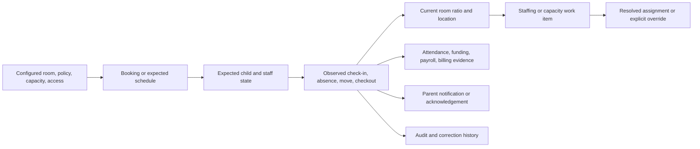

# Kiddz Online Direct Competitor Operational Flow Study

**Date:** 2026-07-10
**Status:** Official-support flow pass 2
**Products:** Brightwheel, Famly, Tapestry, and Cheqdin

## Purpose

The first competitor pass established category breadth from public product pages. This pass goes deeper into the operating sequence behind attendance, staff presence, ratios, room state, booking, occupancy, correction, and evidence.

The goal is not to copy a competitor screen. It is to identify where state originates, which actor records it, how it affects another domain, what can go wrong, how it is corrected, and what evidence remains.

## Evidence Method And Boundary

- Current official help/support material supplies documented navigation, roles, prerequisites, states, and corrections.
- Official help images and product descriptions confirm that screens exist; they do not prove accessibility, speed, motion, hierarchy quality, or task success.
- Exact Brightwheel and Famly Mobbin flow/screen searches were repeated on iOS and web. Results returned Partiful, Luma, Deputy, ClassDojo, 7shifts, Square, and Duolingo, so none is represented as Brightwheel or Famly.
- Adjacent Partiful and Luma check-in previews are used only for narrow interaction comparison and are named as adjacent evidence.
- No authenticated competitor account, production nursery data, or private source was used.

## Brightwheel

Official evidence:

- [Log student attendance as staff](https://help.mybrightwheel.com/en/articles/1031829-log-student-attendance-as-staff)
- [Understanding staff check-in](https://help.mybrightwheel.com/en/articles/8780981-understanding-staff-check-in)
- [Check in and out as staff](https://help.mybrightwheel.com/en/articles/1445626-check-in-and-out-as-staff)
- [Set up a Check-in Kiosk](https://help.mybrightwheel.com/en/articles/1329844-set-up-a-check-in-kiosk)
- [Adjust room settings](https://help.mybrightwheel.com/en/articles/2185549-adjust-room-settings)

### Child attendance sequence

The documented app path is:

1. Open the desired room.
2. Open Attendance.
3. Select one or more students, or select all.
4. Choose Check In/Out, Absent, or Move Room.
5. Close Attendance Mode when finished.

Moving room is a compound transition: the child is checked out of the previous room and into the new room. Student and staff room assignment is a prerequisite.

### Staff presence sequence

Brightwheel supports three attendance entry modes:

- shared kiosk with a staff code;
- QR Quick Scan from a staff device;
- Attendance Mode managed by staff/admin.

The kiosk path requires a unique code, room selection, and an optional health screen. A room move requires the prior room state to close. An open or overlapping timecard blocks a new check-in.

The documented recovery for an overlapping timecard is desktop work: open Staff & Payroll, go to Time tracking, filter the staff member, show open timecards, then add a checkout or remove the invalid entry before retrying.

### Ratio and room state

Room configuration stores a student-to-staff ratio and maximum capacity. Checked-in children can display a checkmark while children not checked in are greyed. Brightwheel explicitly links accurate Room Check ratios to staff checking in and out.

### Transfer to Kiddz

- Child and staff presence are separate observed transitions that converge in one room state.
- Moving a child or staff member is atomic from the user's perspective and must not leave two active rooms.
- Overlap is a named conflict with a correction path, not a generic failure toast.
- Room assignment is both workflow context and authorization input.
- Attendance Mode can support batch speed, but `Select all` must name the target set and cannot default unknown children to present.
- Health screening belongs to the entry transition only when configured and legally appropriate.

### Reject

- A ratio calculated from children while staff attendance is optional or stale.
- Hiding timecard conflicts in a separate payroll system without a direct correction route.
- A shared kiosk that exposes unrelated rooms or child information.
- Treating a room move as two independent best-effort writes.

## Famly

Official evidence:

- [Keep Track of Attendance](https://help.famly.co/en-us/articles/10095856-keep-track-of-attendance)
- [The Check-in/out Screen](https://help.famly.co/en-us/articles/4912295-the-check-in-out-screen)
- [The Room Overview](https://help.famly.co/en-us/articles/4912180-the-room-overview)
- [Occupancy and Future Availability](https://help.famly.co/en/articles/4912131-occupancy-and-future-availability)

### Check-in entry modes

Famly documents:

- a separate shared check-in screen;
- direct check-in from Room Overview;
- QR plus PIN;
- location-based plus PIN;
- printed QR from the parent/staff mobile app.

The separate check-in screen requires feature and role permissions. Room selection precedes child selection. The flow can collect expected collector and pickup time, so the transition can carry safeguarding context rather than only a timestamp.

### Room overview

The current Room Overview is explicitly a live classroom workspace. Its documented graph combines:

- expected children;
- actual children present;
- staff signed in;
- staff-to-child ratio over the day.

Tabs separate all, expected, signed in, napping, sick, and holiday states. Child rows/tiles carry expected time, check-in/out, care activity, allergies/diet, nap, and pickup context. Staff presence appears in the same room workspace.

### Planning and occupancy

Famly separates current room operation from future planning:

- Child attendance shows upcoming checked-in, expected, sick, and holiday counts by room.
- Room Planner shows expected children and staff required for upcoming days/weeks.
- Occupancy and Future Availability forecasts daily/weekly/monthly utilization from room/age-group capacity and attendance schedules.

The occupancy article explicitly states that its forecast is based on capacity and does not calculate by pricing band or invoicing profile. This is evidence that operational occupancy and financial forecasting are different questions.

### Transfer to Kiddz

- The target Room workspace should combine expected, present, staff, ratio, child status, and time without forcing the user to reconcile separate pages.
- The manager home can summarize rooms, but the room remains the source workspace.
- Current, upcoming staffing requirement, and commercial occupancy are separate modes with separate sources.
- Status tabs can reduce roster density only if counts, definitions, and unknown state remain explicit.
- Parent/staff kiosk and practitioner room operation are different projections of the same attendance event.
- Collector/pickup context belongs to safeguarding handoff, not a free-form note hidden after checkout.

### Reject

- One graph that merges current safety, future ratios, capacity, and revenue.
- Greyed photos as the only attendance meaning.
- Hover-only graph detail for a state needed on tablet or by assistive technology.
- Care-activity icon density that hides medical or safeguarding status.

## Tapestry

Official evidence:

- [Management System](https://support.tapestry.info/management-system/)
- [Booking](https://support.tapestry.info/booking/)
- [Registers](https://support.tapestry.info/registers/)

### Source chain

Tapestry documents one explicit causal architecture:

1. Configure sessions, prices, closures, extras, funding, and rooms.
2. Create child bookings.
3. Use bookings to produce expected register rows and invoice inputs.
4. Sign children/staff in and out or record absence.
5. Export registers and attendance evidence.

The same booking source drives capacity planning, staffing, register expectation, and invoicing. Registers are available on app and browser, and printable paper registers remain an outage fallback.

### Transfer to Kiddz

- Expected attendance must trace to bookings/sessions rather than an arbitrary active-child list.
- Invoice lines, funded hours, expected attendance, and register evidence must share a visible source chain.
- Configuration is a prerequisite state with setup validation, not a blank downstream screen.
- Paper/export fallback is part of continuity planning and carries freshness/scope metadata.
- Corrections to booking, attendance, and invoice input need propagation and audit rules.

### Reject

- Duplicating expected attendance independently in attendance, occupancy, and finance.
- An export that cannot state source revision or whether it is current.
- A setup wizard that celebrates completion while required operational configuration remains missing.

## Cheqdin

Official evidence:

- [Before you start using Cheqdin App](https://support.cheqdin.com/support/solutions/articles/48001214077-before-you-start-using-cheqdin-app-what-steps-do-you-need-to-complete-to-use-cheqdin-app-)
- [Ways to sign children in/out](https://support.cheqdin.com/support/solutions/articles/48000982329-what-are-the-best-ways-to-use-cheqdin-to-sign-in-out-children-)
- [Staff PIN and room access](https://support.cheqdin.com/support/solutions/articles/48001049331-where-can-i-find-the-staff-pin-to-do-bulk-sign-in-out-)
- [Occupancy planner setup](https://support.cheqdin.com/support/solutions/articles/48000990001-how-do-i-set-up-the-occupancy-planner-for-my-centre-)
- [Room, age-group, capacity, and ratio setup](https://support.cheqdin.com/support/solutions/articles/48000982248)
- [NCS and ECCE funding reporting](https://support.cheqdin.com/support/solutions/articles/48001264417-using-funding-reporting)

### Operational prerequisites

Cheqdin requires:

- room/class with age group, maximum capacity, and staff-to-child ratio;
- staff access assigned to each room;
- staff/member PIN;
- enrolled children;
- bookings/schedules;
- relevant financial year and optional pricing/closure configuration.

Without bookings, children do not appear in the live sign-in/out register. Without room assignment, staff cannot operate the room.

### Attendance and handoff

Cheqdin supports parent kiosk sign-in/out and staff bulk sign-in/out. Live daily registers derive from schedules and sync to the web portal. It documents digital signatures, room-scoped staff PIN access, parent push notification after sign-in/out, and PDF/Excel attendance evidence.

### Occupancy and availability

The occupancy planner combines room capacity, staff-to-child ratio, session timing, booked children, and manually blocked sessions. If staff unavailability reduces sellable capacity, the documented action is to block spaces manually; those spaces can later be unblocked.

This exposes an important distinction: automatic availability depends on configured capacity and bookings, while an operational staffing exception still requires an explicit human override in the documented flow.

### Funding evidence

The NCS/ECCE report distinguishes claimed, attended, and absent hours and exposes recent history for audit/compliance. Attendance is therefore not only a current room status; it is also evidence affecting public funding.

### Transfer to Kiddz

- Setup readiness needs a dependency view: room, ratio policy, capacity, staff access, child, schedule, and funding/billing configuration.
- Staff access and operational assignment must be enforced together.
- Bulk attendance needs explicit target scope, signature/actor, parent-delivery state, and correction.
- A staff absence should create a capacity/ratio work item with an explainable override, not silently alter future availability.
- Claimed, expected, attended, and absent hours remain separate canonical values.
- Parent notification is a downstream delivery state, not proof that attendance itself committed.

### Reject

- A manual capacity block with no source reason, owner, expiry, or link to the staffing event.
- Treating parent push delivery as attendance evidence.
- One PIN granting every room by default.
- Conflating live occupancy percentage, net free capacity, funded attendance, and invoiced hours.

## Adjacent Mobbin Check-In Evidence

Exact competitor results were unavailable, but two adjacent flows provide narrow interaction evidence:

- [Partiful: Checking in a guest](https://mobbin.com/flows/615d6618-b41d-4b54-a012-d518ef0ad559) opens a bulk-action sheet, then a searchable list with one row action; completion replaces the row action with a visible checkmark.
- [Partiful: Cancelling a check in](https://mobbin.com/flows/c89738be-2928-4ed1-94ac-f730f042656c) asks for confirmation over the source list, names the person, and returns the row to its prior action.
- [Luma: Checking in guests](https://mobbin.com/flows/26b0f3ea-2156-43d2-b580-f4774fbb7fc7) keeps the selected guest detail in a bottom sheet, shows a prominent Check In action, then changes it to Undo Check In with a success message.

### Useful narrow transfers

- Preserve the roster while changing one person's state.
- Replace the row action with the resulting state.
- Name the person and action in reversal confirmation.
- Keep an immediate correction route when the domain allows it.

### Boundary

These event guest flows do not prove childcare authorization, expected-state logic, collector identity, staff ratios, room moves, medical status, audit evidence, offline behavior, or legal correction. Kiddz cannot copy their optimistic simplicity into safeguarding work.

## Cross-Competitor Operating Chain

The direct evidence converges on one causal chain:

No competitor support source justifies the current Kiddz shortcut of treating every active child as present unless unchecked.

## Required Kiddz Workflow

### Opening state

- Name branch, operational date/time, room, expected source revision, staff-presence source, and data freshness.
- Show each room as safe, unsafe, unknown, or not operating.
- Keep current state separate from forecast and commercial occupancy.

### Attendance

- Start from expected/unknown, not present.
- Support explicit single, group, and observed bulk transitions.
- Name `this page`, `this room`, and `all matching` selection.
- Record actor, method, device/projection, time, room, source revision, and optional safeguarding handoff fields.
- A room move is one server-owned transition with conflict handling.
- Preserve correction/reversal history.

### Staff and ratios

- Staff attendance is a first-class input to room ratios.
- Open/overlapping assignment or timecard conflicts block contradictory presence and offer direct correction.
- Ratio calculation names policy version, age mix, children, qualified staff, exclusions, time, and freshness.
- Unsafe/forecast risk creates owned work with cause, consequence, candidate resolution, and confirmation.

### Planning and finance

- Booking feeds expected attendance, staffing demand, capacity, funding, and invoice inputs.
- Live occupancy, booked utilization, future availability, funded hours, and invoiced hours remain separate.
- Overrides carry source, owner, reason, effective interval, expiry/review, and audit.

### Evidence and continuity

- Digital evidence remains exportable with source revision and scope.
- Offline/paper fallback is visible as a fallback, then reconciled deliberately.
- Notification delivery and parent acknowledgement are downstream states.
- No stale cached register remains available after scope loss/logout.

## Anti-Patterns Confirmed By The Flow Pass

- Defaulting every expected child to present.
- Calculating ratios before staff presence is trustworthy.
- Treating room move as two unrelated writes.
- Using `Select all` without naming the set.
- Making overlap/conflict correction a separate scavenger hunt.
- Combining live room state, future staffing, capacity, occupancy, and revenue in one percentage.
- Using photo color/grey or traffic-light color as the only state.
- Automatically changing sellable capacity without an explainable staffing source and override history.
- Treating push delivery, a toast, or a checked row as the only proof of attendance.
- Copying a consumer event check-in flow without nursery authorization, safeguarding, and audit constraints.

## Remaining Research Debt

- Authenticated direct-product use is still needed to measure click paths, interruption recovery, loading, offline behavior, focus, screen-reader output, and real hierarchy quality.
- Exact Brightwheel/Famly Mobbin flows remain unavailable as of this pass.
- Operator validation is still required for opening, room transfer, midday cover, handover, closing, outage, and inspection routines.
- Jurisdiction-specific policy remains governed by `jurisdiction-policy-baseline.md`, not competitor behavior.

These gaps remain implementation and usability-test gates. They do not block the benchmark phase from establishing a defensible target workflow.

## Decision

Kiddz will use a live room operating model built from configured policy, expected schedules, observed child/staff transitions, and versioned corrections. Attendance, ratio, occupancy, staffing, funding, billing, and parent delivery remain linked but distinct states.

This closes the benchmark question of what must connect. It does not choose the final visual territory or authorize production UI changes.
