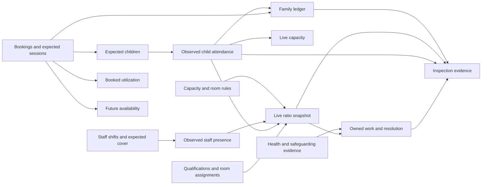
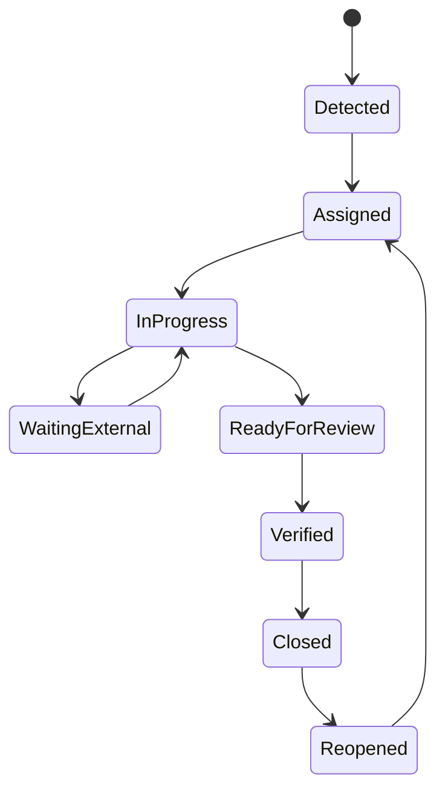

# Kiddz Online Operational Architecture Synthesis

**Status:** Research synthesis v1
**Last updated:** 2026-07-10
**Decision level:** Product architecture baseline for IA, wireframes, state contracts, and visual hierarchy

## Purpose

This document turns the current-product audit, seven journey state audits, authorization evidence, competitor capability research, and benchmark flow study into one operational model. It defines what the redesigned product must make understandable and actionable before visual styling begins.

It does not authorize removal of any restored feature. Existing routes, records, exports, legacy aliases, and native contracts remain parity obligations while the interface converges on canonical workflows.

## Product Thesis

Kiddz Online is a **live, explainable, resolution-oriented operating system for nurseries**.

The manager should not have to combine attendance, staff logs, rooms, alarms, health forms, and finance in their head. The product should assemble those facts into a trustworthy account of:

1. what is expected;
2. what has been observed;
3. what is safe, complete, or at risk;
4. what needs action next;
5. who owns that action;
6. what evidence proves it was handled.

The redesign therefore organizes around operational state and resolution, not a cleaner grid of legacy modules.

## Evidence Inputs

- `current-state-findings.md`: 23 confirmed UX, state, responsive, and permission findings.
- `journey-state-audit.md`: source-backed contracts for opening, attendance, care, health, ratios, finance, and inspection.
- `authorization-scope-audit.md`: role, scope, capability, denial, and audit requirements.
- `jurisdiction-policy-baseline.md`: current England and Ireland ratio, evidence, funding, effective-date, and policy-model constraints.
- `responsive-runtime-audit.md`: measured desktop, tablet, and mobile behavior.
- `competitor-gap-analysis.md`: category baseline and six white-space hypotheses.
- `mobbin-flow-study.md`: consequence review, progressive disclosure, durable status, stable feedback, and recovery patterns.
- `flow-inventory.md` and `parity-domain-ledger.md`: complete restored breadth and compatibility obligations.

## One Operational Chain

The product currently exposes related facts in separate modules. The redesign must make their causal relationship visible without pretending they are already one database object.

Each summary must disclose which source objects produced it, when they changed, and whether the value is observed, expected, inferred, or historical.

## Three Time Modes

Time is a first-class product mode, not a quiet filter.

| Mode | Question | Primary objects | Required signal |
| --- | --- | --- | --- |
| Live operation | Is the nursery safe and on track now? | attendance, presence, room cover, ratios, active health/safety work | Current local time, freshness, unresolved change |
| Planning | What will happen and where are the gaps? | bookings, shifts, qualifications, capacity, funding, occupancy forecast | Future date/range and forecast assumptions |
| Historical evidence | What happened and can we prove it? | revisions, reports, ledger events, acknowledgments, exports | Historical banner, as-of time, provenance |

Changing mode must update the whole workspace. A stale academic year beside a live date is not acceptable. Historical mode receives persistent visual treatment and cannot be mistaken for current operations.

## Canonical Operational Objects

The names may change during domain design; their responsibilities may not.

| Object | Makes possible | Must expose |
| --- | --- | --- |
| OperationalContext | One shared scope for every surface | organization, branch, room, local date/time, academic context, role, revision |
| AttendanceSession and AttendanceEvent | Explicit observed child state | expected roster, unknown/present/absent/late/left, recorder, correction history |
| StaffPresence | Trustworthy live staff state | source, check-in/out, duplicate handling, correction history |
| Shift and RoomAssignment | Expected and actual cover over time | room, interval, role, qualification, source, reassignment |
| RatioRule and RatioSnapshot | Explainable compliance | jurisdiction version, age band, observed/required values, causes, forecast |
| RoomCareSession | Fast batch care with exceptions | shared observation, child exceptions, completeness, draft revision, sync |
| HandoverSession | Accountable shift and room continuity | source obligations, blockers, allowed carry, incoming acknowledgment, source revisions, close receipt |
| WorkItem | Resolution instead of notifications | cause, consequence, owner, due time, state, escalation, resolution evidence |
| MedicalIncident and IncidentObligation | Accountable safety and health lifecycle | source revision, policy version, evidence state, typed reviews, delivery attempts, acknowledgment, follow-up, correction cycle, close receipt |
| RecordRevision and AuditEvent | Accountable change | actor, reason, before/after, source, policy version, correlation ID |
| FamilyLedger and Allocation | One financial truth | charge, payment, allocation, credit, reversal, balance, provenance |
| InspectionPackage and ManifestEntry | Trustworthy regulator evidence | preflight, source revision, checksum, redaction, status, recipient |

Compatibility projections preserve imported structures while canonical objects are introduced. The UI must not display a synthesized value as authoritative until its source contract is implemented.

The territory-neutral `WorkItem` projection is now executable in `src/lib/redesign-action-center-contracts.ts` and `/design-lab/action-center`, with evidence in `action-center-contract.md`. It keeps capability/scope filtering ahead of counts and separates viewed, claimed, deferred, and source-resolved facts. It remains synthetic and additive; source adapters, persistence, escalation policy, authorization, and parity migration are still open.

The territory-neutral child workspace is now executable in `src/lib/redesign-child-workspace-contracts.ts` and `/design-lab/child-workspace`, with evidence in `child-workspace-contract.md`. It composes independently authorized sections, staff/parent-safe source events, safety notices, provenance, and append-only corrections without loading the restored dossier as one permission. It remains synthetic and additive; production capability integration, source adapters, persistence, operator validation, and parity migration are still open.

The territory-neutral medical incident lifecycle is now executable in `src/lib/redesign-medical-incident-contracts.ts` and `/design-lab/incident`, with evidence in `medical-incident-contract.md`. It keeps the source incident separate from review, family delivery, acknowledgment, follow-up, retry, closure, and correction obligations while preserving a capability-safe parent publication boundary. It remains synthetic and additive; production policy, persistence, transactions, outbox/provider integration, source adapters, authorization, operator validation, and parity migration are still open.

The territory-neutral family ledger is now executable in `src/lib/redesign-family-ledger-contracts.ts` and `/design-lab/finance`, with evidence in `family-ledger-contract.md`. It derives family balance, invoice outstanding, unallocated credit, receipt, parent statement, and correction from one immutable event set while failing closed on imported payment/accounting disagreement. It remains synthetic and additive; production source reconciliation, family/account identity, persistence, transactions, numbering/tax policy, authorization, operator validation, and parity migration are still open.

## The Manager Day Model

The primary desktop experience changes emphasis with the operating rhythm while retaining a stable layout.

### Opening

- Confirm expected rooms and children.
- Verify staff arrival, room assignment, qualification, and opening cover.
- Resolve missing records or health notices affecting arrival.
- Confirm readiness with visible exceptions and an audit event.

### Arrival window

- Process observed attendance, late arrivals, unexpected absences, and room changes.
- Recalculate ratios and live capacity from the same events.
- Surface only changes requiring intervention; routine confirmations recede.

### Live day

- Track room state, breaks, handovers, care completion, incidents, and messages.
- Preserve a stable operational picture while the queue changes underneath it.
- Let the manager inspect causes and act without leaving context.

### Handover and departure

- Show children expected to leave, authorized collection context, incomplete care records, and unresolved communication.
- Record transitions explicitly and recalculate room state.

### Closing

- Preflight missing attendance, care, health, finance, and acknowledgment evidence.
- Assign or resolve outstanding work.
- Confirm closure with source revisions and remaining exceptions.

The system should support these rhythms without creating five separate dashboards.

## Today Workspace Hierarchy

Today replaces the split between the current Dashboard and Today page. It has four stable layers.

### 1. Operational context bar

Shows branch, live/planning/history mode, local date/time, freshness, and user scope. Scope changes are deliberate and visible. Emergency or temporary-cover scope is time-bounded and unmistakable.

### 2. Readiness statement

Answers one question in plain language: **Is this branch safe and ready now?**

The statement can be `Unknown`, `Needs attention`, `Safe with exceptions`, or `Safe`. It includes the source timestamp and the most important reason. It is not a decorative score or celebratory illustration.

### 3. Room operating plane

Rooms are the manager's primary comparison unit. Each room row or panel shows:

- room and age-band context;
- expected and observed children;
- expected and observed staff;
- qualification coverage;
- ratio state now and next forecast change;
- the single highest-priority unresolved issue;
- direct inspection of the source facts.

This may be a structured table, timeline, or hybrid. It is not automatically a card grid. Geometry must support comparison across rooms and time.

### 4. Owned work queue

Shows unresolved work ordered by operational consequence, due time, and ownership. It distinguishes detected issues from work already assigned or awaiting another person. Completed work leaves the active queue but remains in history.

Secondary summaries such as occupancy outlook, finance follow-up, and recent communication appear only after live safety and completion state.

## Work Item Lifecycle

Every actionable alert uses one lifecycle:

Not every task needs every state, but every state used must be explicit. A work item includes:

- cause and source record;
- consequence if unresolved;
- severity and due time;
- owner and effective scope;
- allowed next transitions;
- communication or acknowledgment state;
- resolution evidence;
- audit history.

Notification channels may point to a work item. They are not the work item itself.

## Priority Model

Priority is computed from consequence and time, not chosen only by color.

| Priority | Meaning | Interface behavior |
| --- | --- | --- |
| Critical | Immediate safety, safeguarding, legal, or access threat | Leads hierarchy, persistent until owned, explicit resolution CTA |
| Time-sensitive | Safe now but likely to become unsafe or overdue soon | Shows deadline/forecast and prevention action |
| Required | Must be completed for the day, inspection, payroll, or billing | Appears in completion/preflight state |
| Informational | Useful context with no current action | Recedes visually and never competes with active work |

Color, icon, label, and wording reinforce the state together. Brand colors do not substitute for severity semantics.

## Role Projections

Roles see the same underlying objects through different responsibility lenses.

| Role | Home priority | Default scope | Primary actions |
| --- | --- | --- | --- |
| Administrator | Cross-site health, access, data, and unresolved branch risk | Organization | inspect, configure, grant, export, escalate |
| Manager | Live branch readiness and owned exceptions | Assigned branch(es) | confirm, assign, resolve, publish, approve |
| Teacher/practitioner | Room roster and immediate care work | Assigned room/children | observe, record, submit, message, request help |
| Nurse | Due health work and incident triage | Assigned health/branch scope | triage, record, follow up, communicate |
| Doctor | Clinical review queue | Explicit review scope | review, request evidence, authorize transition |
| Parent | Child changes, obligations, and communication | Linked child/family | acknowledge, message, report absence, pay |

Role-specific homes change priority and action density. They do not create separate truths or weaken the server authorization boundary.

## Navigation Consequences

The proposed stable domains remain hypotheses to prototype:

1. Today
2. Children
3. People
4. Places
5. Communication
6. Finance
7. Reports
8. Settings

Rules:

- Today is a working surface, not a link farm.
- Global navigation contains stable domains, never dynamic room or class lists.
- Child, staff, room, invoice, and incident breadth lives in contextual workspaces.
- Search accepts person, room, branch, state, date, and action language.
- Recents and saved views complement navigation for repeated expert work.
- Legacy aliases resolve to canonical destinations without losing deep links.
- Navigation visibility follows the same capability decision as route access; the server remains authoritative.

## Record Workspace Anatomy

Child, staff, room, incident, and financial workspaces share an information sequence rather than one identical template:

1. Identity and current context.
2. Critical restrictions, warnings, or obligations.
3. Current status and next action.
4. Recent activity and owned work.
5. Domain-specific detail.
6. Complete history, attachments, imports, and legacy fields.

Every number or status can reveal its source and history. Archival breadth remains reachable but does not compete with immediate work.

## Action Contract

High-value actions use the same behavioral grammar:

1. **Enter in context:** Start from the affected room, child, work item, or ledger state.
2. **Expose consequence:** Show what will change, who will be affected, and any downstream ratio, finance, communication, or evidence impact.
3. **Validate progressively:** Keep routine entry fast; reveal exceptions and required evidence when triggered.
4. **Confirm on the server:** Completion is a persisted transition, never only a toast, redirect, or browser flag.
5. **Update the source view:** The originating row, room, queue, or record changes immediately from the confirmed result.
6. **Keep recovery adjacent:** Undo, correction, retry, or request-access remains available from the result.
7. **Preserve evidence:** High-risk actions record actor, scope, source revision, policy decision, and reason.

## Cards, Tables, And Charts

### Cards are allowed when

- the object is independently actionable;
- its boundary and state matter;
- it benefits from a self-contained preview;
- cards are not being used to avoid a better comparison layout.

### Cards are rejected when

- a dense room comparison, ledger, schedule, or task list is clearer;
- every module receives an equal tile;
- the card contains a static total with a generic link;
- decoration is doing the work of hierarchy.

### Charts are allowed when

- a trend, distribution, forecast, or comparison answers a named decision;
- the source records and time range are available;
- empty, partial, and dominant-value states remain legible;
- the user can act or drill into the records.

### Charts are rejected when

- a number, ordered list, timeline, or table communicates the answer faster;
- data is fabricated for visual balance;
- live occupancy, booked utilization, and future availability are combined;
- labels collide or meaning depends on color alone.

## State And Recovery Requirements

Every redesigned surface defines:

- loading with stable page identity;
- empty with accurate meaning and an action only when useful;
- partial data and freshness;
- permission denial with safe reason category and destination;
- validation failure beside the affected field or object;
- server failure with preserved input and retry;
- offline queue, sync, and conflict where supported;
- duplicate action and idempotency behavior;
- success with server-confirmed consequence;
- correction, reversal, or undo semantics.

Generic spinners, dead-end errors, and silent redirects do not satisfy the contract.

## Cross-Device Responsibility

- **Wide desktop:** compare rooms, plan, reconcile, review evidence, and resolve multiple work items.
- **Compact desktop:** preserve the same hierarchy with reduced secondary context, never clipped meaning.
- **Tablet:** operate one room, hand over, record care, and respond to assigned exceptions with large targets.
- **Mobile:** capture, confirm, message, receive urgent work, and resume drafts; it is not a stacked desktop dashboard.

State, draft revision, ownership, and history travel across devices. Layout and action density do not have to match.

## Integrity And Authorization Gates

No high-risk redesigned flow ships unless:

- the source of truth is named and persisted;
- tenant, role, assignment, record relation, capability, and transition are checked server-side;
- missing high-risk policy fails closed;
- route, query, mutation, export, and navigation decisions agree;
- writes are atomic or safely resumable;
- completion comes from the server result;
- correction and version history are visible;
- denials do not reveal out-of-scope record existence;
- compatibility routes and native contracts pass the same policy.

## Implementation Order

1. Operational context, capability/scope authorization, audit conventions, and idempotent mutations.
2. Canonical child and staff presence timelines.
3. Shifts, qualifications, room assignment, effective-dated ratio rules, and explainable snapshots.
4. Today, opening readiness, attendance, and room care on those contracts.
5. Medical state machines, ownership, notification, and evidence history.
6. Family ledger convergence and allocation.
7. Inspection preflight and package generation.
8. Compatibility adapters and parity verification throughout, not at the end.

## Prototype Questions

The first IA and wireframe prototypes must answer:

1. Can a manager identify unsafe or unknown rooms in three seconds?
2. Can they explain why a room has its state without leaving Today?
3. Can a routine attendance exception be recorded in two primary actions and safely corrected?
4. Does each work item communicate cause, consequence, owner, and next transition?
5. Can the user distinguish live, planning, and historical modes at all times?
6. Can every summary reveal its source records and freshness?
7. Does the layout preserve desktop comparison while tablet/mobile expose their own job hierarchy?
8. Are all restored capabilities reachable through canonical or legacy-compatible paths?

## Acceptance Measures

- Manager correctly identifies readiness, unknowns, unsafe rooms, and critical health work without navigation.
- No unknown child or staff state is represented as observed presence.
- The same attendance event updates room state, ratio state, history, and parent-safe projections.
- Every active exception has an owner or an explicit unassigned state.
- Routine room work requires no more than two primary actions before exception review.
- High-risk actions display scope and consequence before commitment.
- Every operational summary exposes source and as-of time.
- Desktop critical content fits without page-level horizontal overflow at the supported primary widths.
- Tablet and mobile prototypes contain fewer, more relevant decisions than desktop, not merely stacked geometry.
- Every parity row maps to a retained output, canonical destination, compatibility adapter, or verified migration path.

## Open Validation Debt

The architecture remains provisional where real operating policy is missing:

1. Jurisdiction, age-band, mixed-age, qualification, and emergency ratio rules.
2. Opening, midday, handover, and closing sequence used by real managers.
3. Meaning of branchless, cross-site, substitute, and temporary-cover staff.
4. Clinical authority, dual approval, parent acknowledgment, and escalation requirements.
5. Booking, funding, session, discount, subsidy, and billing source of truth.
6. Offline-critical actions and conflict ownership.
7. Inspection package, retention, encryption, redaction, and consent requirements.
8. Which imported records are immutable evidence and which can enter modern correction workflows.

These questions block legal or domain convergence, not continued prototyping. Until validated, the interface must label assumptions and avoid presenting inferred compliance as fact.
