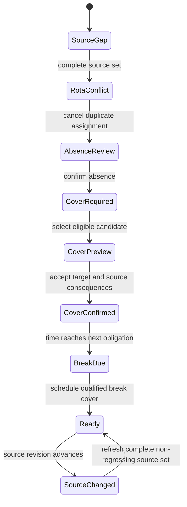

# Staffing and Rota Contract

**Status:** Territory-neutral, executable, synthetic foundation
**Date:** 2026-07-11
**Prototype:** `/design-lab/staffing`
**Contract:** `src/lib/redesign-staffing-rota-contracts.ts`
**Verifier:** `src/scripts/verify-redesign-staffing-rota-contracts.ts`

## Question

How can Kiddz prove that each room has enough present, qualified staff now and through the next change, resolve an absence with temporary cover, and schedule breaks without turning a rota row, class assignment, calendar label, or scanner log into a fact it cannot support?

## Current Product Evidence

The restored product preserves useful staff records and legacy outputs, but it does not yet have a production rota domain.

| Current source | What it proves | What it does not prove |
| --- | --- | --- |
| `Teacher.classId` | One current teacher-to-class association | Shift interval, actual room presence, temporary cover, split shift, or historical assignment |
| `Teacher.specialization`, documents, attachments, education, and experience | Imported staff profile and evidence breadth | An operator-approved, effective-dated qualification that counts for one room or policy |
| `EmployeeEvent` | One day-level `SICK`, `ABSENT`, `DAY_OFF`, or `WARNING` label per employee/type/date | Report versus confirmation, time interval, cover consequence, review, cancellation history, or immutable correction |
| `TeacherAttendance` | Imported or manually entered check-in/out/log evidence | A unique live presence timeline; repeated bulk submission can append duplicates |
| `/employees/calendar` | A monthly staff-event calendar | Rota, room demand, breaks, overlap detection, coverage, or forecast readiness |
| `/employees/attendance` and `/employees/attendance-logs` | Attendance capture, import, filtering, and restored legacy scanner fields | Room-scoped staffing contribution or ratio readiness |
| Staff directory and detail pages | Identity, branch, role, contact, files, and legacy profile breadth | Availability windows, shift assignments, candidate eligibility, or accountable cover |

The current source therefore supports staff identity, static placement, calendar events, and attendance evidence. It cannot be relabeled as a complete rota or a live staffing decision.

## Canonical Separation

The target model keeps these facts separate:

1. **Staff member:** identity, role, branch, and active employment.
2. **Availability:** whether a person can be scheduled for an interval.
3. **Qualification:** an approved, effective-dated permission to contribute in named room scopes.
4. **Shift:** expected work interval and expected room or floating assignment.
5. **Presence observation:** checked in, checked out, or unknown, with a source revision.
6. **Absence:** reported, confirmed, or cancelled, with a bounded interval and private evidence.
7. **Room demand:** operator/policy-supplied required qualified staff for a room and interval.
8. **Break obligation:** duration, due time, state, owner, and accepted cover.
9. **Cover selection:** a reviewable consequence preview bound to a staffing-plan revision.
10. **Cover assignment:** accepted temporary work with start, expiry, cause, actor, and source revision.
11. **Staffing plan event:** immutable accepted history with idempotency key and resulting revision.

No one object substitutes for another. In particular:

- scheduled is not present;
- present is not qualified;
- qualified is not available;
- a reported absence is not a confirmed absence;
- a floating shift is not room cover;
- a scanner row is not a room assignment;
- a class association is not a rota interval;
- an expired qualification never counts because a profile still exists;
- a temporary assignment never becomes permanent silently.

## Room Readiness Equation

For a concrete room and time:

```text
present qualified contribution
  = unique active staff
  assigned to the room by an active shift or cover assignment
  AND explicitly checked in
  AND not confirmed absent
  AND not on a scheduled break
  AND holding a valid room-scoped qualification

staffing gap
  = max(0, policy-supplied required qualified staff - present qualified contribution)
```

If the demand or required source set is incomplete, the gap is `Unknown`, not zero. The prototype exposes scheduled count, included contribution, unknown presence, confirmed absence, break exclusion, gap, next change, and source revision separately.

No jurisdictional ratio, age-band, qualification, break, or staffing number is hardcoded as production policy. The synthetic fixture uses explicit values only to test the contract.

## Lifecycle



Every accepted transition checks:

- actor capability;
- expected plan revision;
- source freshness;
- idempotency key and command fingerprint;
- target room consequence;
- source room consequence;
- time-bounded assignment;
- current candidate eligibility.

## Candidate Eligibility

A cover candidate is eligible only when all of these are true for the entire requested interval:

- active staff record in the permitted branch scope;
- explicit checked-in presence;
- no overlapping confirmed absence;
- an availability window contains the cover interval;
- a current qualification covers the target room;
- the person is not already assigned to the target room;
- moving the person does not create a source-room gap.

The preview must show both outcomes before commitment:

- target room gap after assignment;
- source room gap after assignment.

An accepted assignment is rejected if either calculation changes before commitment. This prevents a manager from apparently resolving Meadow by silently making Sunroom unsafe.

## Breaks

Breaks are obligations, not absence labels. A break keeps its owner, due time, duration, status, scheduled interval, and cover staff identity. During the scheduled interval, the owner stops contributing and the accepted break-cover assignment begins contributing. The same person cannot count twice in one room projection.

The synthetic break path proves that one room remains ready while its lead takes a 30-minute covered break. The duration is fixture data, not a legal rule.

## Source Integrity

The fixture requires six named source families:

1. weekly rota;
2. staff qualifications;
3. gate presence;
4. room demand;
5. absence calendar;
6. break policy.

Initial projection fails closed when one is missing. Confirmation merges source revisions but rejects regression. A later source change pauses accepted work. Refresh must include every tracked source and cannot omit or roll one backward.

Commands are revision-checked and idempotent. Replaying the exact accepted command returns the current accepted plan; reusing its key with changed input fails.

## Role Projection

| Role | Visible | Hidden or disabled |
| --- | --- | --- |
| Nursery manager | Room contributions, staff identity, candidate consequences, private absence evidence, audit, all transitions | Out-of-scope people and branches |
| Rota coordinator | Room contributions, staff identity, absence category/consequence, candidates, audit, scheduling transitions | Private health reason |
| Room practitioner | Room counts and reason categories, own identity/shift/break, readiness state | Colleague identity in the room projection, candidate list, private absence evidence, audit history, staffing mutations |

The practitioner surface does not reveal candidate or colleague names through global status copy. Hidden navigation is not authorization; production reads and writes still require server capability and record-scope enforcement.

## Cross-Device Projection

- **Wide desktop:** compare rooms, inspect contribution reasons, preview candidates, resolve overlap/absence/cover/break, and inspect accepted history.
- **Tablet:** coordinate one branch and its open obligations with 44px controls and reflowed room metrics.
- **Mobile practitioner:** inspect current room readiness and own assignment without receiving the manager candidate table or private absence evidence.

The mobile surface is not a stacked production dashboard claim. It is a constrained contract projection used to verify information reduction and privacy.

## Production Migration Boundary

This slice adds no production schema or behavior. A production migration requires, in order:

1. Operator-approved staff qualification and room-demand policy profiles.
2. Canonical availability, shift, room-assignment, presence-event, absence-revision, break, cover-selection, cover-assignment, and plan-event models.
3. Imported adapters for current `Teacher.classId`, `EmployeeEvent`, `TeacherAttendance`, documents, staff roles, and legacy IDs without overwriting source evidence.
4. Unique/idempotent attendance-event ingestion and duplicate reconciliation.
5. Effective capability and branch/record scope on every query and transition.
6. Atomic cover and break transitions with an outbox for downstream Today/ratio/payroll effects.
7. Effective-dated jurisdiction/operator policy activation; missing high-risk policy fails closed.
8. Compatibility projections for current staff, calendar, attendance, payroll, export, PHP alias, and native/parent contracts.
9. Representative scale, concurrency, offline/retry, operator, assistive-technology, and real-device acceptance.

Current production routes and restored outputs remain authoritative until those gates close.

## Browser Evidence

Agent Browser exercised nine states across three role/viewport projections:

- manager at `1440 x 900`;
- rota coordinator at `768 x 1024`;
- practitioner at `390 x 844`.

All 27 combinations produced:

- the expected lifecycle heading;
- exactly one H1;
- zero horizontal overflow;
- zero unnamed or undersized visible controls;
- zero axe violations;
- zero axe incomplete findings.

Privacy checks proved:

- manager projections retain private absence evidence;
- coordinator projections retain scheduling consequence but remove the private reason;
- practitioner projections expose neither private reason nor colleague identities.

The live manager path exercised all nine transitions from source confirmation through stale-source refresh. Every action returned focus to the new decision heading, updated the polite live region, produced no runtime error, and advanced the plan revision only for accepted domain mutations. Desktop and mobile scroll inspection found coherent layout and no overlap; browser warning/error logs were empty.

## Deterministic Verification

`pnpm exec tsx src/scripts/verify-redesign-staffing-rota-contracts.ts` proves:

- all nine derived states;
- complete source confirmation and non-regression;
- overlap detection and reasoned cancellation;
- absence confirmation and immutable revision advance;
- exact room contribution arithmetic;
- expired qualification rejection;
- target/source room candidate consequences;
- rejection of a transfer that creates a source-room gap;
- revision/idempotency behavior;
- temporary cover resolution;
- break owner exclusion and cover inclusion without a new gap;
- manager/coordinator/practitioner privacy projections;
- stale-source blocking and complete refresh;
- capability denial.

Focused ESLint, full TypeScript, all 16 redesign suites, all 14 staff/teacher/employee/attendance/absence parity suites, diff hygiene, the 341-route/30-alias compatibility census, and the production build pass. The build emits `/design-lab/staffing` statically with only the repository's documented middleware, CSS `@page`, and dynamic-auth prerender warnings.

## Open Gates

- First-market qualification, break, ratio, mixed-age, emergency, and substitute-cover policy.
- Authoritative rota, availability, absence, scanner, payroll, and qualification sources.
- Cross-site and branchless staff rules.
- Split shifts, overnight intervals, cancelled cover, late arrival, early departure, partial absence, and emergency override.
- Concurrency between managers and source devices.
- Payroll/timecard consequences and correction rules.
- Representative staffing scale and multi-branch load.
- Operator observation, real assistive technology, and real devices.
- Selected Daylight, Signal, or Carebook production composition.

These gates block production activation, not the reversible contract. No production staff, event, attendance, calendar, class, branch, ratio, payroll, schema, row, query, mutation, route, permission, export, PHP alias, parent/native payload, or restored capability changed in this slice.
